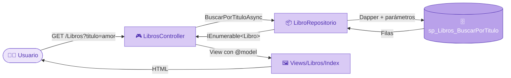

<div align="center">

# 📚 Biblioteca.We

### Sistema de gestión de biblioteca con ASP.NET Core MVC + Dapper

<p>
  
  
  
  
  
  
</p>

**Laboratorio 08 · Desarrollo de Aplicaciones Empresariales Avanzadas · Tecsup 2026-2**

</div>

---

## 💜 Descripción

**Biblioteca.We** es una aplicación web desarrollada con el patrón **Modelo-Vista-Controlador (MVC)** en **ASP.NET Core**. Permite gestionar los **libros**, **socios** y **préstamos** de una biblioteca.

El acceso a datos se realiza con **Dapper**, que ejecuta **procedimientos almacenados** en **SQL Server** sobre la base de datos `BibliotecaDB`. Los controladores no contienen SQL ni abren conexiones: toda la lógica de datos vive en la capa de **Repositorios**.

---

## ✨ Funcionalidades

| Módulo | Funcionalidades |
|---|---|
| 📖 **Libros** | Listado con nombre del autor · Búsqueda por título · Detalle · Crear · Editar · Eliminación lógica |
| 👥 **Socios** | Listado de socios activos · Registro con validación de **DNI duplicado** |
| 📋 **Reporte de préstamos** | Filtro por rango de fechas (desde / hasta) · Socio, libros, fecha límite y estado |

### ⭐ Características destacadas
- ✅ **Eliminación lógica**: los registros no se borran, se marcan con `Activo = 0`
- ✅ **Validaciones** con DataAnnotations (`[Required]`, `[StringLength]`, `[Range]`, `[DataType]`)
- ✅ **Patrón Post/Redirect/Get** con mensajes de confirmación mediante `TempData`
- ✅ **Lista desplegable de autores** en los formularios de libros
- ✅ **Vista parcial** `_FilaLibro` reutilizada en el listado y en la búsqueda
- ✅ **Async/await** de punta a punta (sin `.Result` ni `.Wait()`)
- ✅ **Inyección de dependencias** de los repositorios
- ✅ Diseño **morado pastel** responsivo con Bootstrap 5 y tipografía Poppins

---

## 🔄 Flujo MVC de una petición



---

## 🗂️ Estructura del proyecto

```
Biblioteca.We/
├── Controllers/
│   ├── HomeController.cs
│   ├── LibrosController.cs        # Index, Details, Create, Edit, Delete
│   ├── SociosController.cs        # Index, Create
│   └── PrestamosController.cs     # Reporte
├── Models/
│   ├── Libro.cs                   # Con validaciones DataAnnotations
│   ├── Socio.cs
│   ├── PrestamoReporte.cs
│   └── Autor.cs
├── Repositorios/
│   ├── LibroRepositorio.cs        # Dapper + procedimientos almacenados
│   ├── SocioRepositorio.cs
│   └── PrestamoRepositorio.cs
├── Views/
│   ├── Libros/                    # Index, Details, Create, Edit, Delete, _FilaLibro
│   ├── Socios/                    # Index, Create
│   ├── Prestamos/                 # Reporte
│   └── Shared/_Layout.cshtml      # Menú de navegación
├── Scripts/
│   └── BibliotecaDB_Semana08.sql  # Procedimientos almacenados
├── wwwroot/css/site.css           # Tema morado pastel
├── appsettings.json               # Cadena de conexión
└── Program.cs                     # Registro de repositorios
```

---

## 🗄️ Base de datos

Se reutiliza la base de datos **BibliotecaDB** con las tablas:

`Autores` · `Libros` · `Socios` · `Prestamos` · `DetallePrestamo`

### Procedimientos almacenados

| Procedimiento | Descripción |
|---|---|
| `sp_Libros_Listar` | Libros activos con el nombre del autor (INNER JOIN) |
| `sp_Libros_BuscarPorTitulo` | Búsqueda de libros por título |
| `sp_Libros_ObtenerPorId` | Obtiene un libro por su Id |
| `sp_Libros_Insertar` | Registra un libro con `Activo = 1` |
| `sp_Libros_Actualizar` | Actualiza los datos de un libro |
| `sp_Libros_Eliminar` | Eliminación **lógica** (`Activo = 0`) |
| `sp_Autores_ListarActivos` | Autores activos para la lista desplegable |
| `sp_Socios_ListarActivos` | Socios activos |
| `sp_Socios_Insertar` | Registra un socio validando que el DNI no exista |
| `sp_Prestamos_ReportePorFechas` | Reporte con INNER JOIN entre Prestamos, DetallePrestamo, Libros y Socios |

---

## 🚀 Cómo ejecutar el proyecto

### Requisitos
- Visual Studio 2022 o superior
- .NET 10 SDK
- SQL Server (Express) + SQL Server Management Studio

### Pasos

1. **Clonar el repositorio**
```bash
   git clone https://github.com/Mayela3018/Biblioteca.We.git
```

2. **Base de datos**: tener creada `BibliotecaDB` y ejecutar en SSMS el script:
```
   Biblioteca.We/Scripts/BibliotecaDB_Semana08.sql
```

3. **Configurar la cadena de conexión** en `appsettings.json` con el nombre de tu servidor:
```json
   "ConnectionStrings": {
     "BibliotecaDB": "Server=TU_SERVIDOR\\SQLEXPRESS;Database=BibliotecaDB;Trusted_Connection=True;TrustServerCertificate=True;"
   }
```

4. **Ejecutar** el proyecto con ▶ **https** en Visual Studio.

### 📦 Paquetes NuGet
| Paquete | Uso |
|---|---|
| `Dapper` | Micro-ORM para ejecutar procedimientos almacenados |
| `Microsoft.Data.SqlClient` | Conexión con SQL Server |

---

## 🧠 Lo que aprendí

- Aplicar el patrón **MVC** separando Models, Views y Controllers
- Usar **Dapper** con `QueryAsync` y `ExecuteAsync` sobre procedimientos almacenados
- Implementar **eliminación lógica** para conservar el historial de datos
- Usar **repositorios con inyección de dependencias** para mantener los controladores limpios
- Diferenciar **Modelo, ViewData y TempData** al pasar datos a las vistas
- Aplicar el patrón **Post/Redirect/Get** y **async/await**

---

<div align="center">

## 👩‍💻 Autora

**Mayela Milagros Ticona Mamani**
Estudiante de Diseño y Desarrollo de Software · Tecsup

[](https://github.com/Mayela3018)
[](https://www.linkedin.com/in/mayela-milagros-ticona-mamani/)

💜 *Hecho con dedicación en Lima, Perú · 2026*

</div>
